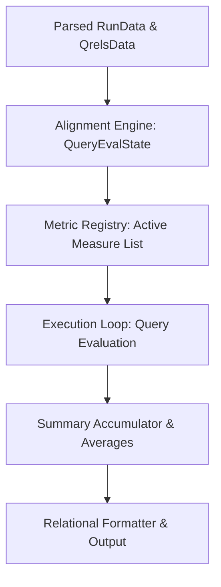

# `te-rust` Metrics and Evaluation Harness Design Document

This document outlines the detailed architectural design for the metrics computation engine and evaluation harness of `te-rust`. The core objectives are strict compatibility with the original C `trec_eval`, high extensibility, numerical robustness, and clean, idiomatic Rust.

---

## 1. High-Level Architecture Overview

The evaluation harness operates as a pipelined engine consisting of four main stages:



1.  **Input Ingestion**: Takes the parsed hierarchical `RunData` and relevance judgments (`QrelsData`, `QrelsJGData`, etc.).
2.  **Alignment Engine**: Groups and aligns retrieved document runs with judgments for each query topic to construct a unified `QueryEvalState`.
3.  **Metrics Execution**: Loops through all active measures, calculating score(s) per topic.
4.  **Summary Aggregation**: Accumulates per-query scores into running totals and calculates final summary statistics (means, sums, geometric means).
5.  **Formatting and Printing**: Formats and outputs scores in standard relational format (`measure  qid  value`).

---

## 2. Runtime Configuration (`EvalConfig`)

All command-line flags and parameters affecting evaluation are encapsulated in a read-only `EvalConfig` struct:

```rust
#[derive(Debug, Clone)]
pub struct EvalConfig {
    /// In addition to summary evaluation, print evaluation for each query/topic (-q).
    pub query_flag: bool,
    
    /// Print summary averages/totals at the end (default true, disabled by -n).
    pub summary_flag: bool,
    
    /// Minimum relevance level at which a document is considered relevant (-l). Default is 1.
    pub relevance_level: i64,
    
    /// Average over the complete set of queries in qrels instead of the intersection (-c).
    pub average_complete_flag: bool,
    
    /// Remove all unjudged documents from the retrieved set before evaluating (-J).
    pub judged_docs_only_flag: bool,
    
    /// Max number of documents per topic to evaluate (-M). Defaults to MAX_LONG.
    pub max_num_docs_per_topic: usize,
    
    /// Total number of documents in the collection (-N). Defaults to 0.
    pub num_docs_in_coll: usize,
}
```

---

## 3. The Aligned Evaluation State (`QueryEvalState`)

To decouple metrics implementation from the physical raw format files, the **Alignment Engine** resolves the ranking, applies tie-breaking, filters unjudged docs if `-J` is set, and produces a standardized `QueryEvalState` for each query topic.

This is the exact Rust equivalent of the C `RES_RELS` structure.

```rust
#[derive(Debug, Clone)]
pub struct QueryEvalState {
    /// Query Identifier.
    pub qid: String,
    
    /// Total number of retrieved documents evaluated (after optional truncation).
    pub num_ret: usize,
    
    /// Total number of relevant documents for this topic in the judgments file.
    /// Specifically, count of documents with relevance judgment >= Config.relevance_level.
    pub num_rel: usize,
    
    /// Total retrieved relevant documents (relevance >= Config.relevance_level).
    pub num_rel_ret: usize,
    
    /// Total retrieved documents not present in the relevance judgments.
    pub num_nonpool: usize,
    
    /// Total retrieved documents present in judgments but marked unjudged (value < 0).
    pub num_unjudged_in_pool: usize,
    
    /// Aligned ranked list of relevance judgments.
    /// Each element corresponds to a retrieved document at that rank.
    /// Values:
    /// - `rel >= 0`: Judged relevance score.
    /// - `-1`: Not in pool (unjudged / not present in qrels).
    /// - `-2`: Present in pool but explicitly unjudged (some specialized measures treat this differently).
    pub results_rel_list: Vec<i64>,
    
    /// Frequency counts of judged documents in qrels at each non-negative relevance level.
    /// Index represents the relevance score; value represents the count of documents in qrels.
    /// Defensively sized to at least `max(max_rel + 1, config.relevance_level + 1)` to prevent out-of-bounds reads.
    pub rel_levels: Vec<usize>,
}
```

### 3.1 Alignment and Tie-Breaking Algorithm
To construct `QueryEvalState` from a `RunQuery` and a `QrelsQuery`:
1.  **Copy and Sort Run Records**: Copy similarity scores and document IDs into a temporary list. Sort them descending by `sim` (primary), and **descending lexicographically** by `docno` (secondary) to break ties deterministically.
2.  **Truncate**: If the list size exceeds `config.max_num_docs_per_topic`, truncate the list.
3.  **Filter Unjudged (-J)**: If `config.judged_docs_only_flag` is true, perform a scan to discard any documents that do not exist in the qrels with a non-negative judgment. Preserve the relative tie-broken ranking.
4.  **Align with Qrels**: Align the sorted retrieved documents with the pre-sorted qrels list:
    *   If retrieved document `docno` is found in the qrels: assign its relevance. If `rel >= 0`, increment the corresponding index in `rel_levels`. If `rel < 0`, assign `-2` (unjudged in pool).
    *   If not found: assign `-1` (non-pool).
5.  **Finish Counting judgments**: Scan remaining unretrieved qrels entries to fully populate `rel_levels` and compute the total `num_rel` (the sum of all `rel_levels[i]` where `i >= config.relevance_level`).
    *   **Defensive Allocation & Sizing**: The `rel_levels` vector is pre-allocated and initialized with `0`s to a size of `max(max_rel + 1, config.relevance_level + 1)` where `max_rel` is the maximum non-negative relevance score observed in the qrels for that topic.
    *   **Infallible Count Retrieval**: Measures must retrieve counts from `rel_levels` using bounds-checked indexing (such as `state.rel_levels.get(j).copied().unwrap_or(0)`) rather than direct indexing (`state.rel_levels[j]`). This ensures absolute panic-free execution even if a metric queries high relevance threshold levels that were never observed in the input file.

### 3.2 Handling Missing Queries Natively (-c Complete Set Evaluation)
To maintain 100% score parity with C `trec_eval` under complete set evaluation (`-c` or `average_complete_flag`) while eliminating C's fragile internal `bogus_ranking` ("ceci_nest_pas_un_docno") hack and hardcoded memory override loops:

1.  **Strict Intersection vs. Complete Evaluation**:
    *   By default, `te-rust` only evaluates queries present in both the relevance judgments and the run results ($Q_{\text{qrels}} \cap Q_{\text{run}}$). If a query exists in the judgments but is missing from the run, it is silently skipped.
    *   If `config.average_complete_flag` is true, the execution harness evaluates **every** query present in the judgments ($Q_{\text{qrels}}$).
2.  **Native Empty State Construction**:
    *   For any query present in the judgments but completely absent from the run file, the alignment engine constructs a native empty `QueryEvalState`:
        *   `results_rel_list` is initialized as a completely empty vector (`Vec::new()`), indicating natively that 0 documents were retrieved.
        *   `rel_levels` is populated with the correct judgment counts from the `QrelsQuery` records, and `num_rel` is computed normally.
3.  **Self-Contained Metric Execution**:
    *   Because metrics evaluate this empty state natively (e.g., precision/recall-based measures return `0.0`, count-based measures return `0.0`, and utility measures return their baseline cost constants directly), there is no need to insert fake document strings into memory or run post-evaluation override cleanups. This ensures modular, robust, and crash-safe evaluation.

### 3.3 Aligning and Counting Preferences (`PrefsEvalState`)
When evaluating preference files (`trec_prefs`) or qrels-based preference formats (`qrels_prefs`):

1.  **Assigning Internal Ranks (0..num_judged)**:
    *   Find the set of all unique document IDs mentioned in any preference relation for the query. Let this count be `num_judged`.
    *   Sort this set such that documents that were actually retrieved in the run are placed first (ordered by their retrieved rank, indices `0` to `num_judged_ret - 1`).
    *   Place all remaining unretrieved judged documents next (indices `num_judged_ret` to `num_judged - 1`), keeping their document IDs sorted lexicographically.
    *   This internal rank (0..num_judged-1) uniquely and deterministically represents each judged document. A document was retrieved if and only if its internal rank `rank < num_judged_ret`.

2.  **Representing and Propagating Preferences**:
    *   **Representation A (Equivalence Classes)**: Used if there is only 1 judgment sub-group. Documents are grouped into `EquivalenceClass` structures, sorted by decreasing relevance level `rel_level`. All pairs between separate classes imply a preference (higher `rel_level` preferred to lower `rel_level`).
    *   **Representation B (Preference Matrix)**: Used if there are multiple sub-groups. We initialize a boolean matrix `matrix` of size `num_judged * num_judged` to `false`. We set `matrix[i][j] = true` if a direct preference $i > j$ is stated in any sub-group of this JG.
    *   **Transitive Closure**: Because preferences in multiple sub-groups can chain (e.g. $A > B$ and $B > C$), we must compute the transitive closure of the preference relation. To prevent any chance of regression bugs or edge-case divergences, we will implement **two independent transitive closure strategies** inside the codebase to enable comprehensive differential testing during development:
        *   **Strategy A: Naive C-Style Matrix Exponentiation (Naive Reference)**:
            An exact port of Chris Buckley's original iterative matrix multiplication loop from `form_prefs_counts.c`. This serves as our strict behavioral oracle.
        *   **Strategy B: Bit-Parallel Warshall's Algorithm (Production Optimisation)**:
            An $O(N^3 / 64)$ bit-vector optimized Warshall transitive closure algorithm utilizing flat word arrays and sequential CPU bit manipulation operations.
        *   **Comparative Validation**: The evaluation engine will include a developer assertion hook that runs both strategies in parallel and compares their resulting matrices. This guarantees that we verify Strategy B's safety under all imaginable dataset conditions before disabling Strategy A in production.

3.  **Accumulating Combinatorial Counts**:
    *   For **Equivalence Classes**:
        We compare every pair of classes $ec1 < ec2$ (where $ec1$ has higher relevance than $ec2$). For every document rank $ptr1 \in ec1$ and $ptr2 \in ec2$:
        *   Increment `pref_counts[ptr1][ptr2] += 1`.
        *   If both are retrieved ($ptr1 < num\_judged\_ret$ and $ptr2 < num\_judged\_ret$):
            *   If $ptr1 < ptr2$ (preferred doc $ptr1$ is retrieved before $ptr2$): increment `num_prefs_fulfilled_ret`.
            *   Else: increment `num_prefs_possible_ret`.
        *   If exactly one is retrieved:
            *   If $ptr1 < num\_judged\_ret$: increment `num_prefs_fulfilled_imp`.
            *   Else: increment `num_prefs_possible_imp`.
        *   If neither is retrieved: increment `num_prefs_possible_notoccur`.
    *   For **Preference Matrix**:
        For every pair of internal ranks $i$ and $j$ where `matrix[i][j]` is true ($i$ is preferred to $j$):
        *   Increment `pref_counts[i][j] += 1`.
        *   If both are retrieved ($i < num\_judged\_ret$ and $j < num\_judged\_ret$):
            *   If $i < j$: increment `num_prefs_fulfilled_ret`.
            *   Else: increment `num_prefs_possible_ret`.
        *   If exactly one is retrieved:
            *   If $i < num\_judged\_ret$: increment `num_prefs_fulfilled_imp`.
            *   Else: increment `num_prefs_possible_imp`.
        *   If neither is retrieved: increment `num_prefs_possible_notoccur`.
    *   At the end of count accumulation, standard additions are performed:
        *   `num_prefs_possible_ret += num_prefs_fulfilled_ret;`
        *   `num_prefs_possible_imp += num_prefs_fulfilled_imp;`

---

## 4. The Extensible Metric Architecture (`Measure` Trait)

We define a clean, modular `Measure` trait. Every standard and custom metric implements this trait, decoupling the evaluation harness from specific metric math.

To handle different printing requirements for different measures (e.g. floats vs. integers vs. raw strings), we introduce a `ValueFormat` enum:

```rust
#[derive(Debug, Copy, Clone, PartialEq, Eq)]
pub enum ValueFormat {
    /// Render as a double-precision float with exactly 4 decimal places (e.g. 0.2543).
    Float,
    /// Render as an integer (e.g. 4328).
    Integer,
    /// Render as a raw string (e.g. runid "my_runtag").
    Str,
    /// Render as a string wrapped in single quotes (e.g. relstring "'1-0-1'").
    QuotedStr,
}
```

To support type-safe returned values from metrics, we define the `MetricValue` enum:

```rust
#[derive(Debug, Clone, PartialEq)]
pub enum MetricValue {
    Float(f64),
    Integer(i64),
    Str(String),
}
```

### 4.1 Metric Compatibility and Evaluation States

To prevent running measures on incompatible relevance judgment formats (e.g., trying to calculate `map` on a preference file, or `prefs_simp` on standard `qrels`), we define the required evaluation categories and state enums:

```rust
#[derive(Debug, Copy, Clone, PartialEq, Eq)]
pub enum EvaluationType {
    /// Standard evaluation (e.g. map, P, ndcg) using standard qrels.
    Standard,
    /// Pairwise preference-based evaluation (e.g. prefs_simp, prefs_pair) using prefs or qrels_prefs.
    Preferences,
}

/// Unified aligned evaluation state passed to metrics during calculation.
#[derive(Debug, Clone)]
pub enum EvalState {
    Standard(QueryEvalState),
    Prefs(PrefsEvalState), // PrefsEvalState contains pairwise counts of preferred documents
}

/// Represents an Equivalence Class (EC) within a Judgment Group.
#[derive(Debug, Clone)]
pub struct EquivalenceClass {
    /// Relevance level of this equivalence class.
    pub rel_level: f64,
    /// The assigned internal ranks (0..num_judged-1) of documents belonging to this EC.
    pub ranks: Vec<usize>,
}

/// Represents a single Judgment Group (JG) for a query.
#[derive(Debug, Clone)]
pub struct JudgmentGroup {
    /// Equivalence classes ordered by decreasing relevance level.
    /// Used if there is only 1 judgment sub-group.
    pub ecs: Vec<EquivalenceClass>,

    /// A partial-order preference matrix where `matrix[i][j]` is true iff
    /// internal rank `i` is preferred to internal rank `j` in this JG.
    /// Used when multiple judgment sub-groups (JSGs) are present.
    /// Dimension: num_judged * num_judged.
    pub prefs_matrix: Option<Vec<Vec<bool>>>,

    /// Relevance levels for each judged document by internal rank.
    /// Dimension: num_judged.
    pub rel_array: Vec<f64>,

    // --- Aggregated Combinatorial Counts ---
    /// Both A and B are retrieved, and preferred A is ranked higher than less-preferred B.
    pub num_prefs_fulfilled_ret: usize,
    /// Both A and B are retrieved, regardless of ranking.
    pub num_prefs_possible_ret: usize,
    /// Exactly one of A or B is retrieved, and the preferred A is retrieved (implied fulfilled).
    pub num_prefs_fulfilled_imp: usize,
    /// Exactly one of A or B is retrieved (implied possible).
    pub num_prefs_possible_imp: usize,
    /// Neither A nor B is retrieved (possible but did not occur).
    pub num_prefs_possible_notoccur: usize,

    /// Count of judged documents with `rel_level == 0.0`.
    pub num_nonrel: usize,
    /// Count of retrieved judged documents with `rel_level == 0.0`.
    pub num_nonrel_ret: usize,
    /// Count of judged documents with `rel_level > 0.0`.
    pub num_rel: usize,
    /// Count of retrieved judged documents with `rel_level > 0.0`.
    pub num_rel_ret: usize,
}

/// Aligned evaluation state for preference-based metrics.
#[derive(Debug, Clone)]
pub struct PrefsEvalState {
    /// List of judgment groups for this query.
    pub jgs: Vec<JudgmentGroup>,

    /// Total number of distinct documents mentioned in any preference for this query.
    pub num_judged: usize,

    /// Number of those judged documents that were actually retrieved.
    pub num_judged_ret: usize,

    /// Accumulator matrix of size `num_judged * num_judged` where `pref_counts[i][j]`
    /// counts how many JGs prefer internal rank `i` to internal rank `j`.
    /// Used directly for pairwise conflict and confirmation metrics.
    pub pref_counts: Vec<Vec<usize>>,
}
```

Every metric implementation declares its compatibility and calculates structured `MetricValue` elements:

```rust
pub trait Measure: Send + Sync {
    /// Unique root name of the measure (e.g. "map", "P").
    fn name(&self) -> &'static str;

    /// Detailed description/explanation of the measure.
    fn explanation(&self) -> &'static str;

    /// Printing format for the metric's values.
    fn format(&self) -> ValueFormat;

    /// The category of relevance judgments required by this measure.
    fn eval_type(&self) -> EvaluationType;

    /// Returns the exact sub-metric names to be calculated (e.g., `["P_5", "P_10", "P_15"]`).
    /// These are determined and pre-computed during struct instantiation based on custom parameters.
    fn sub_metrics(&self) -> Vec<String>;

    /// Returns the initial values for the running totals of this measure (e.g., `[Float(0.0), Float(0.0)]`).
    /// The harness uses this to initialize the query aggregation accumulator.
    fn initial_values(&self) -> Vec<MetricValue>;

    /// Calculate the score(s) for a single query.
    /// Returns a vector of MetricValue corresponding in order to the sub-metric names returned by `sub_metrics`.
    fn calc(&self, config: &EvalConfig, state: &EvalState) -> Vec<MetricValue>;

    /// Accumulate a single query's scores into a running total.
    /// Defaults to type-safe numeric summation. Strings are not accumulated.
    fn accumulate(&self, q_scores: &[MetricValue], running_totals: &mut [MetricValue]) {
        for (i, score) in q_scores.iter().enumerate() {
            match (score, &mut running_totals[i]) {
                (MetricValue::Float(s), MetricValue::Float(t)) => *t += s,
                (MetricValue::Integer(s), MetricValue::Integer(t)) => *t += s,
                _ => {} // Strings and non-matching types do not accumulate
            }
        }
    }

    /// Calculate the final summary score from the accumulated totals.
    /// By default, divides double-precision running totals by the query count.
    /// For sums (e.g. `num_ret`), this can be overridden to be a no-op.
    fn average(&self, config: &EvalConfig, running_totals: &mut [MetricValue], num_queries_evaluated: usize, total_qrels_queries: usize) {
        let denominator = if config.average_complete_flag {
            total_qrels_queries
        } else {
            num_queries_evaluated
        };
        if denominator > 0 {
            for total in running_totals.iter_mut() {
                if let MetricValue::Float(t) = total {
                    *t /= denominator as f64;
                }
            }
        }
    }
}
```

---

## 5. Implementation Specifications for Core Metrics

Here is the exact mathematical implementation design for some of the most critical standard metrics.

### 5.1 Mean Average Precision (`map`)
*   **Sub-metrics**: `["map"]`
*   **Query Calculation**:
    For each rank $i$ (0-indexed) where `results_rel_list[i] >= config.relevance_level`:
    *   Increment `rel_so_far`.
    *   Add precision at rank $i$ to sum: $\text{sum} \gets \text{sum} + \frac{\text{rel\_so\_far}}{i + 1}$.
    *   At the end, if `rel_so_far > 0`, the score is $\frac{\text{sum}}{\text{state.num\_rel}}$. If `rel_so_far == 0`, the score is `0.0`.
*   **Average**: Standard arithmetic mean.

### 5.2 Geometric Mean MAP (`gm_map`)
*   **Sub-metrics**: `["gm_map"]`
*   **Query Calculation**:
    Compute Average Precision (AP) exactly as in `map`.
    *   The single-query value stored is the natural logarithm of the score, bounded from below by `MIN_GEO_MEAN` ($10^{-5}$):
        $$\text{score} = \ln(\max(\text{AP}, 10^{-5}))$$
*   **Accumulate**: Standard sum of query log scores.
*   **Average**:
    Sum up the log scores. If `average_complete_flag` is true, add $(N_{\text{qrels}} - N_{\text{evaluated}}) \times \ln(10^{-5})$ to the sum to account for missing queries.
    *   Divide the final sum by the denominator ($N_{\text{evaluated}}$ or $N_{\text{qrels}}$) and exponentiate:
        $$\text{summary\_score} = \exp\left(\frac{\text{sum}}{\text{denominator}}\right)$$

### 5.3 Precision at Cutoffs (`P`)
*   **Sub-metrics**: Default cutoffs are `[5, 10, 15, 20, 30, 100, 200, 500, 1000]`. If parameters are passed, parse as comma-separated integers.
*   **Query Calculation**:
    For each cutoff $C$:
    *   Let $R_C$ be the number of relevant documents retrieved up to rank $C$.
    *   The precision at $C$ is $\frac{R_C}{C}$. (If fewer than $C$ documents are retrieved, unretrieved ranks are filled with non-relevant documents, matching C behavior).
*   **Average**: Standard arithmetic mean per cutoff.

### 5.4 Count Metrics (`num_ret`, `num_rel`, `num_rel_ret`)
*   **Query Calculation**:
    *   `num_ret`: returns `MetricValue::Integer(state.num_ret as i64)`.
    *   `num_rel`: returns `MetricValue::Integer(state.num_rel as i64)`.
    *   `num_rel_ret`: returns `MetricValue::Integer(state.num_rel_ret as i64)`.
*   **Accumulate**: Standard sum of query values.
*   **Average**: Overridden to be a **no-op** (so summary totals represent the sum of all queries, rather than their mean).

### 5.5 String-Valued Metrics (`runid`, `relstring`)
*   **`runid`**:
    *   **Format**: `ValueFormat::Str`
    *   **Query Calculation**: Returns `MetricValue::Str(state.run_id.clone())`.
    *   **Accumulate & Average**: No-ops. At the summary level, prints the run ID of the evaluated run.
*   **`relstring`**:
    *   **Format**: `ValueFormat::QuotedStr` (prints wrapped in single quotes).
    *   **Query Calculation**: Returns a string representation of the relevance level of the top $N$ retrieved docs. For each rank up to $N$:
        *   If `rel > 9`, append `>`.
        *   Else if `rel >= 0`, append the digit char.
        *   Else if `rel == -1` (nonpool), append `-`.
        *   Else if `rel == -2` (unjudged in pool), append `.`.
        *   Else, append `<`.
    *   **Accumulate & Average**: No-ops (not printed at the summary level).


---

## 6. Numerical Robustness and Edge Case Handling

Standard floating-point operations can introduce differences due to precision and ordering. To guarantee identical outputs to `trec_eval`:

1.  **Division by Zero & NaN Prevention (Measure-Dependent)**:
    *   Boundary conditions (e.g., zero relevant documents in qrels, zero documents retrieved, or zero ideal DCG) must not generate raw floating-point `NaN` or `Infinity` values.
    *   Rather than assuming a universal fallback of `0.0`, the correct score in these undefined or zero-division states is **measure-dependent** and must match the exact behavioral specifications of the corresponding metric in `trec_eval` (for example, some utility metrics or cost-benefit measures may default to a baseline cost constant rather than `0.0`).
    *   Each individual `Measure` implementation is responsible for explicitly checking for its own mathematical boundary cases and returning its specific defined safe fallback value to prevent corrupt non-finite floats from propagating into the accumulation/averaging phase.
2.  **Infallible Float Sorting and Parsing Constraints**:
    *   During parsing, the ingestion engine strictly validates and rejects non-finite floating-point strings (`NaN`, `Infinity`, `inf`) to prevent corrupt values from entering the evaluation pipeline.
    *   The alignment engine sorts document similarity scores descending using `f64::total_cmp` (stabilized in Rust 1.62). This compiles to branchless, high-performance bit-level instructions, eliminates the need for `.partial_cmp().unwrap()`, and guarantees deterministic tie-breaking even if un-validated float representations are encountered in memory.
3.  **Geometric Mean Underflow**:
    *   Always use `1e-5` (`MIN_GEO_MEAN`) as the floor for log calculation to prevent $\ln(0)$ running into negative infinity.

---

## 7. Command Output formatting and Alignment

To mimic the exact formatting of `trec_eval`, we print values in three columns separated by tabs, with floating-point values formatted to exactly 4 decimal places:

```text
map         all     0.2543
P_5         all     0.3200
num_ret     all     4328
map         030     0.1242
P_5         030     0.2000
```

*   When running with `-q`, per-query outputs are printed sequentially grouped by topic, followed by the `all` summary lines at the end.
*   The default order of measures follows the order of registration in the active metrics registry, matching standard `trec_eval` layout.
