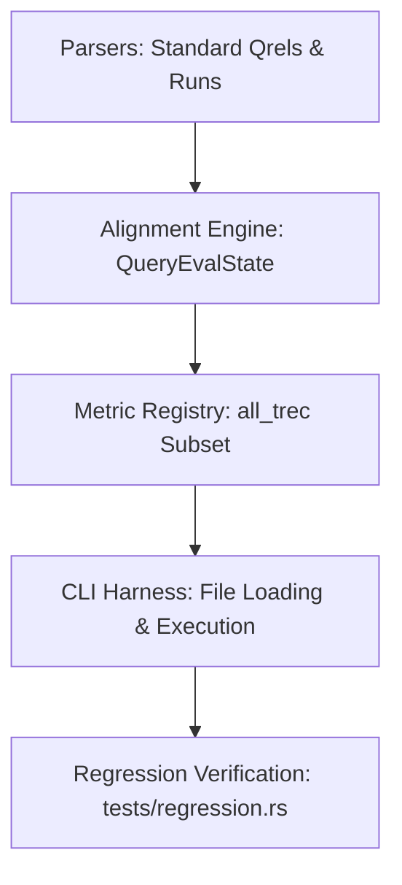

# `te-rust` Staged Implementation Plan

This document defines the structured, three-stage development plan for `te-rust`, transitioning from core parsing and standard evaluation up to specialized parametric measures and preference-based evaluations.

---

## Stage 1: Core Parsing & Standard Evaluation (`all_trec`)

The primary objective of Stage 1 is to build the core evaluation pipeline, support standard inputs (standard qrels and run results), and implement the `all_trec` standard metric set to verify perfect numerical parity with C `trec_eval` under standard quicktests.

### 1.1 Project Structure Setup
*   Initialize the `te-rust` directory with a standard workspace structure.
*   Configure `Cargo.toml` with release optimizations (e.g., Link-Time Optimization (LTO) and codegen-units) to match C execution speeds.

### 1.2 Core Input Parsers (`src/io/parsers.rs`)
*   **Standard Run Parser**: Whitespace-separated fields (`qid  iter  docno  rank  sim  run_id`).
*   **Standard Qrels Parser**: Whitespace-separated fields (`qid  iter  docno  rel`).
*   **Safety Guards**: 
    *   Strict non-finite float rejection (`NaN`, `Infinity`) for similarity scores.
    *   Generous relevance score boundary validation (`-1,000,000` to `1,000,000`) to prevent allocation exploits.
    *   Indentation-agnostic `#` comment stripping (trimming leading spaces).

### 1.3 Aligned Evaluation Engine (`src/eval/alignment.rs`)
*   **Tie-Breaking sorting**: Sort results descending by `sim` (primary), and **lexicographically descending** by `docno` (secondary) to match C tie-breaking exactly.
*   **Defensive Allocation**: Populate `QueryEvalState::rel_levels` pre-allocated and initialized with zeros to `max(max_rel + 1, config.relevance_level + 1)` size.
*   **Complete Set Average (`-c`)**: Implement native empty execution states (`Vec::new()`) for topics missing from the run results file under `-c`, ensuring proper default score evaluation without overrides.

### 1.4 The `all_trec` Metric Registry (`src/metrics/`)
Implement the `Measure` trait and the following core metrics (the standard `all_trec` set):
*   **Count measures**: `num_ret`, `num_rel`, `num_rel_ret`.
*   **Mean Average Precision (`map`)**.
*   **Precision at cutoffs (`P_cut`)**: Precision at fixed ranks (5, 10, 15, 20, 30, 100, 200, 500, 1000).
*   **R-Precision (`Rprec`)**.
*   **Reciprocal Rank (`recip_rank`)**.
*   **Binary Preference (`bpref`)**: Binary preference computation using bounds-checked counts.
*   **nDCG at cutoffs (`ndcg_cut`)**: Discounted Cumulative Gain utilizing `f64::total_cmp` for deterministic ranking and division-by-zero guards.

### 1.5 CLI Driver & Averages Accumulator (`src/main.rs`)
*   Load files, invoke alignment, and execute metrics.
*   Accumulate per-query totals and calculate final summary averages.
*   Output scores in standard relational format (`measure  qid  value`).

### 1.6 Verification Harness (`tests/regression.rs`)
*   Copy standard test files (`qrels.test`, `results.test`, `out.test`, `out.test.a`, `out.test.aq`, `out.test.aqc`) from `trec_eval` to `tests/test_data/`.
*   Implement the regression test runner using precompiled binaries via `env!("CARGO_BIN_EXE_te-rust")`.
*   Execute key-by-key relational triple assertions with a float epsilon of `1e-4` to secure perfect numerical equivalence.

---

## Stage 2: Advanced Formats, Specialized Measures, and CLI Options

Stage 2 extends the core pipeline to support arbitrary parameter configurations, advanced non-standard file formats, and complete command line flag parity.

### 2.1 Parameter-Driven Metric Execution
*   Parse metric-specific parameter arguments from the command line (e.g., `-m P.5,10,20` or `-m ndcg_cut.10`).
*   Create stateless metric instances dynamically matching requested parameter cutoffs.

### 2.2 Advanced Non-Standard Parsers
*   **Relstring Format Parser**: Support for parsing explicit relevance strings.
*   **Relstring Relevance Level Formatting**: Support for parameter cutoffs and relevance levels on non-standard fields.

### 2.3 Additional Metrics and Flags Parity
*   **Additional measures**: `success`, 11-point average precision (`11pt_avg`), custom parametric recall, and cost-weighted `utility`.
*   **CLI flag parity**: Complete support for `-q` (per-query), `-n` (disable summary averages), `-l` (relevance level threshold), `-M` (max documents per topic), and `-N` (collection size).
*   Verify parametric quicktests (`test_meas_params` and `test_relstring_relevance_level`).

---

## Stage 3: Preference-Based Evaluation & Comparative Verification

Stage 3 implements the complete preference-based evaluation architecture (`trec_prefs`), verifying partial-order zones and transitive relations.

### 3.1 Preference Input Parsers
*   **Prefs Parser**: Parses explicit pairwise preferences (`qid  docno_A  docno_B  JSG_id`).
*   **Qrels-Prefs/Qrels-JG Parsers**: Map qrels records to preference counts.

### 3.2 Preference Alignment & Dual Transitive Closures
*   Assign deterministic internal ranks (`0..num_judged`) grouping retrieved items first.
*   Implement both transitive closure methods in the engine:
    *   **Strategy A (Naive Matrix Exponentiation)**: Exact behavioral port of C's multiplication loop for strict verification.
    *   **Strategy B (Bit-Parallel Warshall)**: High-performance $O(N^3/64)$ production optimizer.
*   During test execution, run both strategies in parallel and assert matrix equivalence to mathematically prove Strategy B's safety.

### 3.3 Preference Metrics & Final Validation
*   Implement `prefs_num_prefs`, `prefs_simp`, `prefs_pair`, `prefs_avgjg`, etc.
*   Run final quicktests (`test_all_prefs`, `test_all_prefs_comments`, `test_qrels_jg`) to verify complete parity across all evaluation formats.
