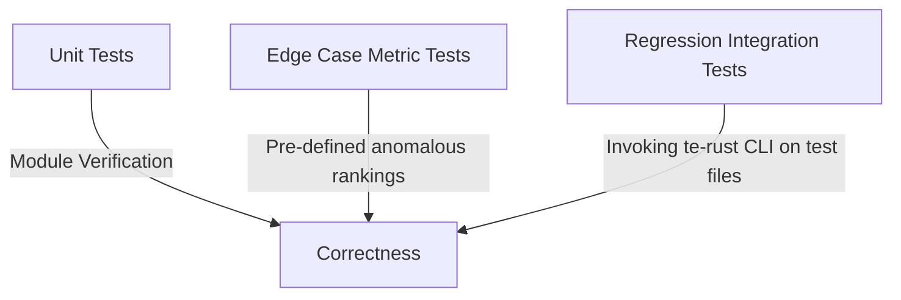

# `te-rust` Testing and Regression Strategy Design Document

This document outlines the design and implementation plan for the testing and verification framework of `te-rust`. The strategy encompasses unit testing, edge-case metric verification, and a comprehensive regression testing suite mapped from the original C `trec_eval` `quicktest` harness.

---

## 1. Testing Framework Architecture

The testing strategy is structured into three layers to ensure robustness, numerical correctness, and complete backwards compatibility:



1.  **Unit Tests**: Located inside src modules (e.g., `src/io/parsers.rs`). Verifies file format line parsers, CRLF/LF handling, duplicate detection, comment stripping, and strict finite-float validation.
2.  **Edge Case Metric Tests**: Specialized unit and integration tests checking specific mathematical behaviors of the metrics under boundary conditions (e.g., empty rankings).
3.  **Regression Suite (C Quicktest Replay)**: A standard integration test file under `tests/regression.rs` that executes the compiled `te-rust` binary against copied test data and compares output streams with C's expected results.

---

## 2. Regression Test Suite Design (C 'quicktest' Replay)

To verify that `te-rust` is a 100% drop-in replacement, we copy all files from `trec_eval/test/` to `te-rust/tests/test_data/` and implement the 13 quicktest cases as standard Rust integration tests.

### 2.1 File Organization
The directory structure under `te-rust` will look like this:

```text
te-rust/
├── Cargo.toml
├── src/
│   └── ...
└── tests/
    ├── regression.rs
    └── test_data/             <-- Copied from trec_eval/test/
        ├── qrels.test
        ├── results.test
        ├── out.test
        ├── out.test.a
        ├── out.test.aq
        └── ...
```

### 2.2 Integration Test Harness Design
We will write a robust, stateless runner in `tests/regression.rs`. We can implement it using standard Rust standard library tools without needing heavy external dependencies:

```rust
use std::process::Command;
use std::fs;
use std::path::PathBuf;
use std::collections::HashMap;

/// Parses standard trec_eval relational triple format output ("measure qid value")
/// into a structured map for robust, formatting-agnostic comparisons.
fn parse_trec_output(content: &str) -> HashMap<(String, String), String> {
    let mut map = HashMap::new();
    for line in content.lines() {
        let trimmed = line.trim();
        if trimmed.is_empty() || trimmed.starts_with('#') {
            continue;
        }
        let parts: Vec<&str> = trimmed.split_whitespace().collect();
        if parts.len() == 3 {
            let measure = parts[0].to_string();
            let qid = parts[1].to_string();
            let value = parts[2].to_string();
            map.insert((measure, qid), value);
        }
    }
    map
}

/// Compares actual and expected outputs key-by-key, utilizing a small epsilon
/// tolerance for floating-point values to tolerate minor representation rounding.
fn assert_trec_outputs_match(actual: &str, expected: &str, epsilon: f64) {
    let actual_map = parse_trec_output(actual);
    let expected_map = parse_trec_output(expected);

    assert_eq!(
        actual_map.len(),
        expected_map.len(),
        "Total number of evaluated triples mismatched. Actual: {}, Expected: {}",
        actual_map.len(),
        expected_map.len()
    );

    for (key, expected_val) in &expected_map {
        let actual_val = actual_map.get(key).unwrap_or_else(|| {
            panic!("Expected triple {:?} was not found in actual output", key);
        });

        // Attempt numerical comparison if both parse as floats
        if let (Ok(act_f), Ok(exp_f)) = (actual_val.parse::<f64>(), expected_val.parse::<f64>()) {
            if act_f.is_nan() || exp_f.is_nan() {
                assert_eq!(actual_val, expected_val, "NaN value mismatch for {:?}", key);
            } else {
                let diff = (act_f - exp_f).abs();
                assert!(
                    diff <= epsilon,
                    "Numerical mismatch for {:?}: actual={}, expected={} (diff {} > {})",
                    key,
                    act_f,
                    exp_f,
                    diff,
                    epsilon
                );
            }
        } else {
            // Fallback to strict string matching for non-numeric fields (e.g. run_id, text tags)
            assert_eq!(
                actual_val,
                expected_val,
                "Strict string mismatch for {:?}: actual='{}', expected='{}'",
                key,
                actual_val,
                expected_val
            );
        }
    }
}

fn run_regression(args: &[&str], expected_output_file: &str) {
    // 1. Locate pre-compiled binary via Cargo env macro (prevents deadlocks and cargo locks)
    let bin_path = env!("CARGO_BIN_EXE_te-rust");
    let mut cmd = Command::new(bin_path);
    
    // 2. Append execution args
    for arg in args {
        cmd.arg(arg);
    }
    
    // 3. Execute command and capture output
    let output = cmd.output().expect("Failed to execute te-rust binary");
    assert!(output.status.success(), "Binary exited with failure status");
    
    let actual_stdout = String::from_utf8(output.stdout)
        .expect("Stdout is not valid UTF-8");
        
    // 4. Load expected output
    let expected_path = PathBuf::from("tests/test_data").join(expected_output_file);
    let expected_content = fs::read_to_string(expected_path)
        .expect("Failed to read expected output file");
        
    // 5. Compare relational tables key-by-key with an epsilon tolerance of 1e-4
    assert_trec_outputs_match(&actual_stdout, &expected_content, 1e-4);
}
```

---

## 3. The 13 Quicktest Cases to Implement

Our `tests/regression.rs` will include exactly the following `#[test]` definitions to cover the entire suite:

| Case | CLI Command | Expected Output File |
|---|---|---|
| `test_basic` | `qrels.test results.test` | `out.test` |
| `test_qrels_with_comments` | `qrels.test.with-comments results.test` | `out.test` |
| `test_comments_in_both` | `qrels.comment.test results.comment.test` | `out.comment.test` |
| `test_all_trec` | `-m all_trec qrels.test results.test` | `out.test.a` |
| `test_all_trec_per_query` | `-m all_trec -q qrels.test results.test` | `out.test.aq` |
| `test_all_trec_average_complete` | `-m all_trec -q -c qrels.test results.trunc` | `out.test.aqc` |
| `test_all_trec_max_docs` | `-m all_trec -q -c -M100 qrels.test results.trunc` | `out.test.aqcM` |
| `test_relstring_relevance_level` | `-m all_trec -mrelstring.20 -q -l2 qrels.rel_level results.test` | `out.test.aql` |
| `test_all_prefs` | `-m all_prefs -q -R prefs prefs.test prefs.results.test` | `out.test.prefs` |
| `test_all_prefs_comments` | `-m all_prefs -q -R prefs prefs.comment.test prefs.results.test` | `out.test.prefs` |
| `test_qrels_prefs` | `-m all_prefs -q -R qrels_prefs qrels.test results.test` | `out.test.qrels_prefs` |
| `test_qrels_jg` | `-m qrels_jg -q -R qrels_jg qrels.123 results.test` | `out.test.qrels_jg` |
| `test_meas_params` | `-q -miprec_at_recall..10,.20,.25,.75,.50 -m P.5,7,3 -m recall.20,2000 -m Rprec_mult.5.0,0.2,0.35 -mutility.2,-1,0,0 -m 11pt_avg..25,.5,.75 -mndcg.1=3,2=9,4=4.5 -mndcg_cut.10,20,23.4 -msuccess.2,5,20 qrels.test results.test` | `out.test.meas_params` |

---

## 4. Edge Case Metrics Verification Matrix

To fulfill the strict testing guidelines of `AGENTS.md`, we will develop dedicated unit tests within each metric module to check boundary conditions. This matrix outlines the exact mock state values used for validation:

| Boundary Condition | Mock Input State | Expected Metric Scores |
|---|---|---|
| **No retrieved documents** | `results_rel_list = []`, `num_rel = 10` | `map = 0.0`, `P_5 = 0.0`, `recall = 0.0`, `ndcg = 0.0` |
| **No relevant documents in topic** | `results_rel_list = [1, 2]`, `num_rel = 0` | Precision and MAP are defined as `0.0`. |
| **No judged documents in retrieved set** | `results_rel_list = [-1, -1, -1]`, `num_rel = 5` | Under standard evaluation, treated as non-relevant (`0.0`). |
| **Single relevant retrieved at rank 1** | `results_rel_list = [1]`, `num_rel = 1` | `map = 1.0`, `P_1 = 1.0`, `recall = 1.0` |
| **Single non-relevant retrieved** | `results_rel_list = [0]`, `num_rel = 1` | `map = 0.0`, `P_1 = 0.0`, `recall = 0.0` |
| **All relevant documents retrieved at end** | `results_rel_list = [0, 0, 1]`, `num_rel = 1` | `map = 0.3333`, `P_3 = 0.3333`, `recall = 1.0` |

---

## 5. Shared Test Helpers & Macro-Driven Boundary Checking

To completely eliminate copying and pasting identical mock states and assertion boilerplate from measure to measure (fulfilling the architectural goal of non-duplication), we design a **declarative, macro-driven boundary testing helper**.

### 5.1 Shared Mock State Construction
We implement a unified, reusable generator in our test utilities (`tests/common/metrics.rs` or under a `#[cfg(test)]` module) that builds correct aligned structures for boundary queries:

```rust
#[cfg(test)]
pub fn make_mock_state(results_rel_list: Vec<i64>, num_rel: i64) -> QueryEvalState {
    let num_ret = results_rel_list.len();
    let num_rel_ret = results_rel_list.iter().filter(|&&r| r >= 1).count(); // assume relevance cutoff >= 1
    QueryEvalState {
        qid: "mock_topic".to_string(),
        run_id: "mock_run".to_string(),
        results_rel_list,
        num_ret,
        num_rel,
        num_rel_ret,
    }
}
```

### 5.2 Declarative Testing Macro
We introduce a standard Rust macro `test_measure_boundaries!` to define the boundary testing matrix declaratively. This provides compile-time correctness guarantees while keeping the test suite remarkably clean and dry:

```rust
#[macro_export]
macro_rules! test_measure_boundaries {
    ($test_name:ident, $measure_expr:expr, {
        $($state:expr => $expected:expr),* $(,)?
    }) => {
        #[test]
        fn $test_name() {
            let measure = $measure_expr;
            let config = $crate::metrics::EvalConfig::default();
            $(
                let actual = measure.calc(&config, &$crate::metrics::EvalState::Standard($state));
                assert_eq!(
                    actual, 
                    $expected, 
                    "Failure in boundary case for measure: {}", 
                    measure.name()
                );
            )*
        }
    };
}
```

### 5.3 Example Usage for MAP vs. Precision Cutoffs
With this macro, a developer testing boundary cases for multiple metrics writes only a few lines of declarative mappings:

```rust
// In src/metrics/map.rs
test_measure_boundaries!(
    test_map_boundary_matrix,
    MapMeasure::new(),
    {
        make_mock_state(vec![], 5) => vec![MetricValue::Float(0.0)],
        make_mock_state(vec![1, 0, 1], 0) => vec![MetricValue::Float(0.0)],
        make_mock_state(vec![1], 1) => vec![MetricValue::Float(1.0)],
    }
);

// In src/metrics/precision.rs
test_measure_boundaries!(
    test_precision_boundary_matrix,
    PrecisionMeasure::new(vec![5]), // cutoff 5
    {
        make_mock_state(vec![], 5) => vec![MetricValue::Float(0.0)],
        make_mock_state(vec![1], 1) => vec![MetricValue::Float(0.2)], // 1/5 relevant
    }
);
```
This design completely separates mock data definition from metric evaluation logic, allowing new boundary cases to be checked across all measures without duplication.

---

## 6. Uniform Automated Boundary Verification Suite

To guarantee that **every single standard metric** (both current and future additions) is uniformly and automatically tested against all boundary conditions without relying on developers remembering to use macros, we implement a centralized, automated testing engine.

### 6.1 Leveraging the Central Measure Registry
Our application defines a central registry of all active measures (used by the main execution harness to locate and instantiate requested measures). For example:

```rust
pub fn get_all_measures() -> Vec<Box<dyn Measure>> {
    vec![
        Box::new(MapMeasure::new()),
        Box::new(PrecisionMeasure::default()),
        Box::new(RecallMeasure::default()),
        Box::new(NumRetMeasure::new()),
        Box::new(NumRelMeasure::new()),
        Box::new(NumRelRetMeasure::new()),
        // ... all other measures are registered here
    ]
}
```

### 6.2 Centralized Verification Runner (`tests/uniform_boundaries.rs`)
We implement a single, unified integration test that retrieves all registered measures and subjects them to the core boundary conditions. 

Rather than expecting identical specific numeric values (which vary by metric parameters), this runner asserts **mathematical invariants** and **safety constraints** that must hold universally for all metrics within specific formatting classes:

```rust
#[test]
fn test_uniform_boundary_invariants() {
    let measures = get_all_measures();
    let config = EvalConfig::default();

    // Core Boundary States
    let state_empty_ranking = make_mock_state(vec![], 10);
    let state_zero_relevance = make_mock_state(vec![1, 1, 1], 0);

    for measure in measures {
        // We only verify standard-relevance measures in this standard suite
        if measure.eval_type() != EvaluationType::Standard {
            continue;
        }

        // --- BOUNDARY CASE A: EMPTY RANKING ---
        let scores_empty = measure.calc(&config, &EvalState::Standard(state_empty_ranking.clone()));
        assert!(!scores_empty.is_empty(), "Measure '{}' returned no scores", measure.name());

        for score in &scores_empty {
            match score {
                MetricValue::Float(f) => {
                    assert!(f.is_finite(), "Measure '{}' returned non-finite value ({}) under empty ranking", measure.name(), f);
                    // Standard precision/recall/utility/MAP float measures must evaluate to 0.0 when nothing is retrieved
                    assert_eq!(*f, 0.0, "Float measure '{}' did not evaluate to 0.0 under empty ranking", measure.name());
                }
                MetricValue::Integer(i) => {
                    // Integer count measures must evaluate to 0 under empty ranking (e.g. zero retrieved, zero relevant retrieved)
                    assert_eq!(*i, 0, "Integer measure '{}' did not evaluate to 0 under empty ranking", measure.name());
                }
                MetricValue::Str(_) => {
                    // String measures (like runid) should not panic or fail
                }
            }
        }

        // --- BOUNDARY CASE B: ZERO-RELEVANCE TOPIC ---
        let scores_zero_rel = measure.calc(&config, &EvalState::Standard(state_zero_relevance.clone()));
        assert!(!scores_zero_rel.is_empty(), "Measure '{}' returned no scores", measure.name());

        for score in &scores_zero_rel {
            match score {
                MetricValue::Float(f) => {
                    assert!(f.is_finite(), "Measure '{}' returned non-finite value under zero-relevance topic", measure.name());
                    // Standard float-based precision and MAP measures are mathematically defined as 0.0 when no relevant documents exist
                    // Note: This automatically validates that division-by-zero bounds are safely caught and default to 0.0.
                    assert_eq!(*f, 0.0, "Float measure '{}' did not evaluate to 0.0 under zero-relevance topic", measure.name());
                }
                MetricValue::Integer(_) => {
                    // Integer count measures (like num_ret) are still valid under zero-relevance, so we only assert they do not panic
                }
                MetricValue::Str(_) => {}
            }
        }
    }
}
```

### 6.3 Benefits of Centralized Invariant Testing:
*   **Total Uniform Enforcement**: It is physically impossible to add a metric to the central registry and forget to test it against the standard boundary cases. The integration test will automatically discover the new metric and check it.
*   **Zero Repetition**: No macros or test blocks need to be written inside new metric files for standard boundary states.
*   **Robust Precision Testing**: By asserting that float outputs are finite and default to `0.0` under zero relevance (where standard math would divide by zero), we guarantee complete resilience against nan/infinity errors uniformly across the entire metrics module.


